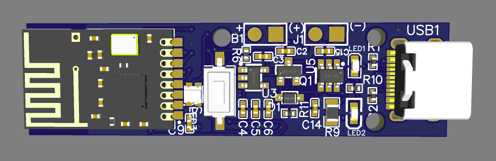
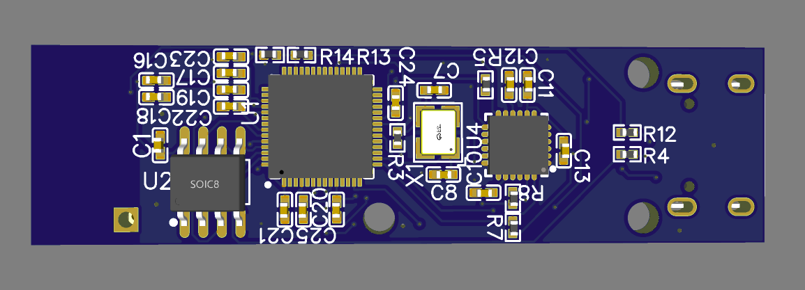
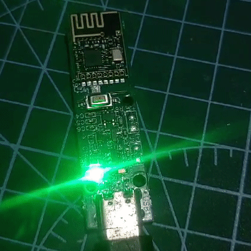
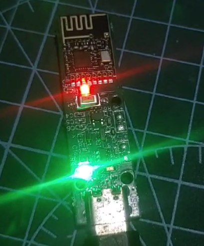
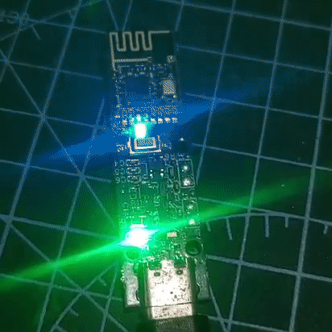
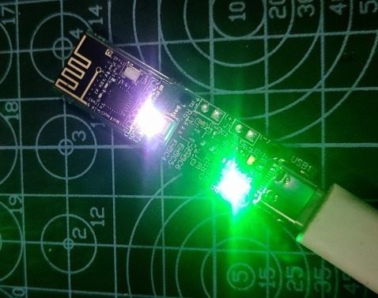

# RP2040_pedal
device made around RP2040 to measure Bicycle pedal's RPM and Angle

# Working:

- ## Pairing:
    
  - On fresh start(new device), the device will go into pairing mode and look for pairing messages from any nearby receiver.
  - Device can be set into Pairing mode manually by **long pressing the button.**
  - The device will only save one paring data, so any earlier connections will be erased on connecting new receiver
  - The will be in pairing mode for 10 seconds and will automatically switch back to normal operation mode then after
  - Orange LED blinks when in pairing mode
  - If pairing is done, device will switch to normal operation mode

- ## Calibrating:
    
  - The device will go into calibration mode when the **button is double clicked.**
  - When a user notices any uncertain or false data, the device can be set into calibration mode to calibrate the sensor.
  - Device will be in this mode for 10-15 seconds and the RED LED will be on during calibration time.
  - After 10-15 seconds, the device will switch to Normal Operation mode automatically

- ## Normal Operation mode:
    
  - the device will be in Normal operation mode irrespective of pairing and calibration
  - The device continuously sends the sensor data  in the form of struct
  - Blue and green LED blinks in Normal operation mode and actively transmitting

- ## Sleep Mode:
  - In Normal mode, if the device was not disturbed for 5 seconds, it will enter sleep mode
  - The device will wake up from sleep mode immediately if there is any movement or disturbance and begins actively transmitting until device comes to rest or disturbance ends

- ## Error Handling:
    
  - If the RP2040 fails to communicate with the peripherals (NRF24 and MPU6050) or if the peripherals stop responding for any reason, the device lights an strong Violet light for one second and Restart itself.
  

## Repository map:

- **Fabrication :** this folder contains all the PCB fabrication files
- **Pedal\_V1.1 :** this folder contains all the source code and testing codes
- **Trail codes :** this folder contains all the intermediate testing codes
- **Img :** This folder contains all the images

